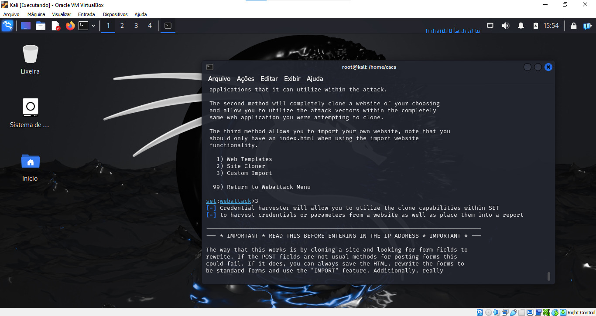

# Phishing para captura de senhas do Facebook

### Ferramentas

- Kali Linux
- setoolkit

### Configurando o Phishing no Kali Linux

- Acesso root: ``` sudo su ```

- Iniciando o setoolkit: ``` setoolkit && y ```

- Tipo de ataque: ``` Social-Engineering Attacks ```

- Vetor de ataque: ``` Web Site Attack Vectors ```

- Método de ataque: ```Credential Harvester Attack Method ```

- Método de ataque: ``` Custom Importer ```

- Visite a página do facebook, salve como index.html

- Pegue o código fonte e salve no novo index.html

- Procure dentro do index.html o script com o atributo data-bootloader-hash e apague
- Volte ao setoolkit e coloque o caminho da pasta para o site salvo em HTML

- Tipo de importação: ```Copy the entire folder```
- URL para clone: http://www.facebook.com

### Resutados


